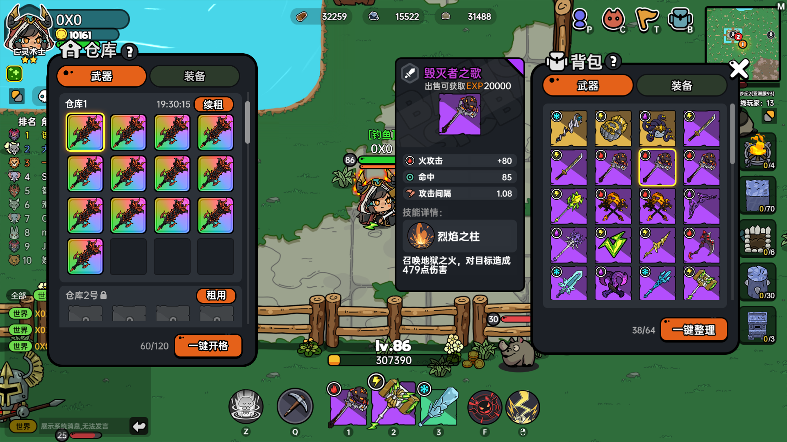
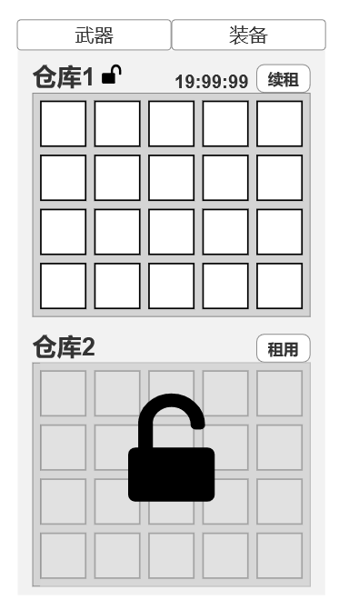

    
        仓库系统
    

# 一、概述

1、仓库需要通过局内NPC进入
2、仓库分为武器仓库和装备仓库，可以分别存放武器和装备
3、仓库分为多个子仓库，默认锁定，需要消耗钻石租用和续租
4、仓库到期后，仓库中的装备会被冻结，需要续租才能正常取用。

# 二、基础规则

## 1、效果图

## 2、激活交互

1、游戏局内主城会有NPC：仓库管理员
2、玩家在NPC附近点击【空格键】交互，打开仓库页
3、仓库页打开期间，玩家移动超过一定距离，自动关闭仓库页（具体距离可参考其他NPC）
4、点击仓库or背包的武器/装备选择页签，仓库和背包都会同步切换

## 3、存储交互

1、仓库页打开期间，鼠标悬停展示武器/装备详细信息

2、右键点击背包里的武器/装备，尝试存到仓库的**第一个空格子**中。
2.1、**同类型**仓库无空位时（有至少一个同类型仓库租用中），存储失败。 tips：*操作失败，仓库已满！*
2.2、**同类型**仓库有空位时，存储成功。 tips：*操作成功！*
2.3、**同类型**所有仓库都不在租期内，存储失败。 tips：*操作失败，暂无仓库！*

3、从背包中拖拽武器/装备到仓库任一**已解锁仓库的存储格**位置，尝试存到选中目标仓库格子。
3.1、目标位置有武器/装备，两件装备/武器进行交换。tips：*操作成功！*
3.2、目标位置没有武器/装备，拖拽的武器/装备直接存到仓库选中格子中。tips：*操作成功！*

4、从背包中拖拽武器/装备到仓库UI任一**未解锁仓库**or/**仓库的非子仓库区域**，尝试存到仓库的**第一个空格子**中。
4.1、有**同类型**的已解锁子仓库且无空位时，存储失败。 tips：*操作失败，仓库已满！*
4.2、仓库有空位时，存储成功。 tips：*操作成功！*
4.3、所有仓库都未解锁，存储失败。 tips：*操作失败，暂无仓库！*

5、从背包中拖拽武器/装备到非仓库且非背包区域。弹窗执行装备丢弃流程，参考正常打开背包扔武器。

## 4、取出装备

1、右键点击租期中的子仓库任一存储武器/装备。
1.1、背包已满，取出失败。 tips：*操作失败，背包已满！*
1.2、背包没满，取出成功。 tips：*操作成功！*

2、从仓库中拖拽装备/武器到其他仓库。
2.1、目标仓库没在租期，移动失败。   tips：*暂无该仓库使用权！*
2.2、目标仓库没在租期，移动位置没装备，选中装备直接移动过去。
2.3、目标仓库没在租期，移动位置有装备，两件装备交换。

3、从仓库中拖拽装备/武器到背包。
3.1、背包没有空位，取出失败。   tips：*操作失败，背包已满！*
3.2、背包有空位，直接取出来，放在背包第一个空位。   tips：*操作成功！*

4、从仓库中拖拽装备/武器到非仓库且非背包区域：松开鼠标，装备/武器回到原位。

# 三、租用规则

## 1、概述

1、武器仓库和装备仓库都有5个子仓库。
2、每个子仓库相互独立，且各为一个整体。
3、到期后仓库中的武器/装备冻结。

## 2、租金

1、武器仓库和装备仓库各有5个子仓库，总共10个子仓库，支持配置。
2、子仓库从上到下分别对应：武器/装备1号仓库，武器/装备2号仓库......
3、所有子仓库默认不在租期
4、每个子仓库需要单独租用，且租期独立
5、每个子仓库租金均不一致

## 3、租用交互

1、每个子仓库左侧都有一个租用/续租按钮
2、点击按钮弹窗：*确定消耗[钻石]xxxx租用该仓库7天时间吗？*
3、完成租用操作后，仓库新增7日使用权，叠加无上限
4、按钮旁边显示剩余租期
4.1、租期小于一天时，显示：*23:59:59*
4.2、租期大于一天时，显示：*99d  23:59:59*

## 4、租期结束

1、仓库租期结束后，仓库停止使用
2、仓库中存储的装备/武器冻结状态，禁止取出，同时禁止存入新装备/武器
3、尝试取出冻结状态的装备/武器，tips:*操作失败，仓库已到期！*

# 四、一键整理

## 1、整理操作

1、仓库最下方有一个一键整理按钮
2、点击进入一键整理流程

## 2、整理规则

1、一键整理只作用于选中仓库类型的所有子仓库（装备or武器）
2、每个子仓库单独
